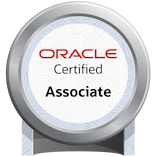
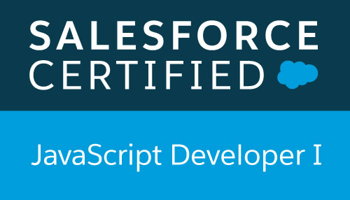
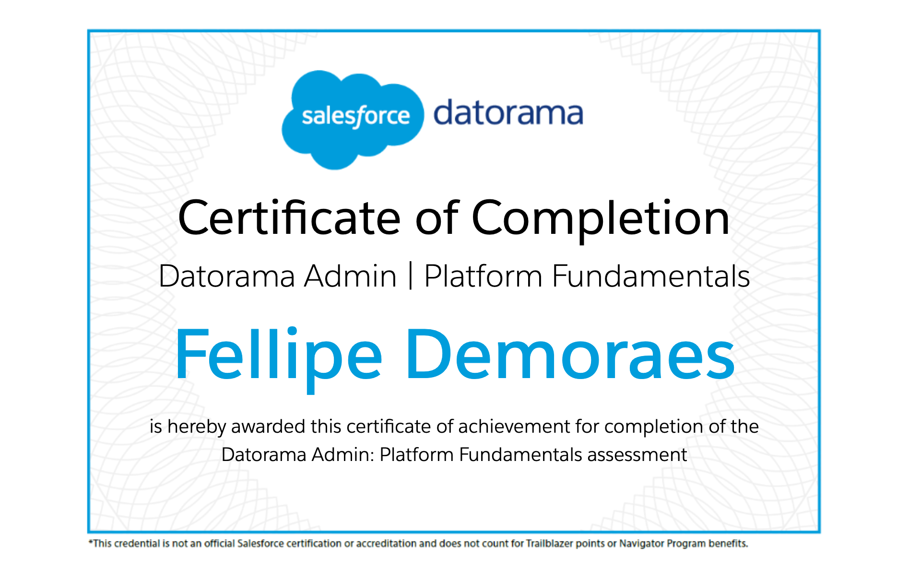

### Hi there 👋

#### Certifications

 

  

I'm looking into 👇  

- Python: https://docs.python.org/3.11/tutorial/controlflow.html 4.8.2  
- Java: OCP Java SE 8 Programmer II Exam Guide (Exam 1Z0-809), 7th Edition    
- CompTia Security+  
- MDN JavaScript https://developer.mozilla.org/en-US/docs/Learn/JavaScript/Building_blocks/Events  
- TryHackMe Cyber Defence https://tryhackme.com/dashboard   

<!--
**fddemora/fddemora** is a ✨ _special_ ✨ repository because its `README.md` (this file) appears on your GitHub profile.

Here are some ideas to get you started:

- 🔭 I’m currently working on ...
- 🌱 I’m currently learning ...
- 👯 I’m looking to collaborate on ...
- 🤔 I’m looking for help with ...
- 💬 Ask me about ...
- 📫 How to reach me: ...
- 😄 Pronouns: ...
- ⚡ Fun fact: ...
-->

