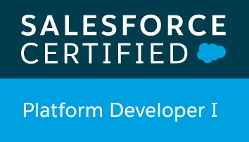

### Hi there 👋

#### A little about me:
- Job title: Program Analyst
- Knowledge in web development, OOP, bash, and more
- Love to learn and improve

I'll use Github to track my learning process, so in my repo's, you can find out what I'm up to!

<!--
**fddemora/fddemora** is a ✨ _special_ ✨ repository because its `README.md` (this file) appears on your GitHub profile.

Here are some ideas to get you started:

- 🔭 I’m currently working on ...
- 🌱 I’m currently learning ...
- 👯 I’m looking to collaborate on ...
- 🤔 I’m looking for help with ...
- 💬 Ask me about ...
- 📫 How to reach me: ...
- 😄 Pronouns: ...
- ⚡ Fun fact: ...
-->
